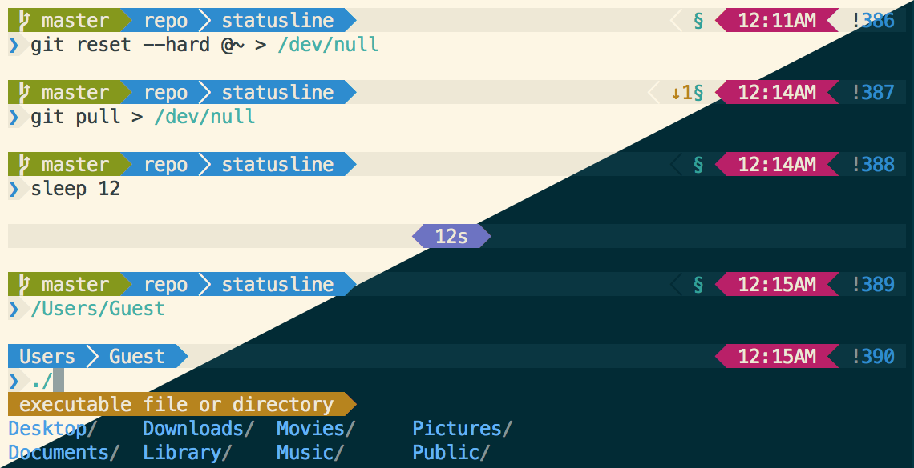
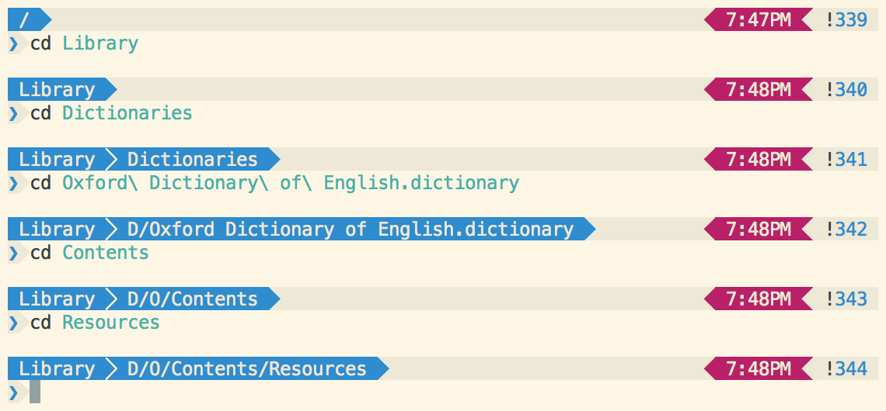

Statusline
===========



### A Powerline theme for prezto and oh-my-zsh
Wish your prompt displayed more information, but afraid of cluttering your prompt? Statusline is a responsive zsh theme that provides informational segments when you need them. For example, statusline only displays your user and machine names when you are in a remote shell. Likewise, task runtimes are only shown when they exceed ten seconds, the current working directory is dynamically shortened to fit onscreen, and more! Statusline is designed for solarized, and is compatible with the default OS X Terminal.app.

_Disclaimer: oh-my-zsh version is not up to date._

### Prerequisites
(The [prezto version's installer](prezto/) checks for and installs all prerequisites)
- [Powerline-patched menlo font](setup/MenloforPowerline-Regular.otf) (optional, see `--font` option)
- [Solarized light](setup/Solarized\ Light.terminal) or [solarized dark](setup/Solarized\ Dark.terminal) Terminal.app profiles
- zsh `5.0.0+` and git `2.0.0+`

## [Prezto](https://github.com/sorin-ionescu/prezto)
The [prezto version](prezto/) is more optimized for zsh than the other version and runs much faster. It also shows additional git information, among other enhancements. Since it uses the prezto `git` and `editor` modules, it is not compatible with oh-my-zsh. However, I recommend prezto over oh-my-zsh because of snappier prompt loading and faster startup time.

### Installation
Simply run this in your shell:
```zsh
zsh -c "$(curl -fsSL https://raw.githubusercontent.com/el1t/statusline/master/prezto/install)"
```
[Manual installation](prezto/README.md)

### Features
- **Asynchronous** git status loading
- Task **runtime**
- **Light** and **dark** themes
- **Contextual** segments
- Fully **modular** design
- Custom `PS1`, `RPS1`, `PS2`, `RPS2`, `PS3`, `PS4`, `SPROMPT`, and completion formatting
- **Dual-** and **single-line** prompts
- **Powerline** and **legacy font** support
- Tmux compatible

### Segments
| Name       | Description               | Context                      |
| ---------- | ------------------------- | ---------------------------- |
| status     | SU/exit code/running jobs | when statuses are present    |
| user       | username                  | when in a remote shell       |
| machine    | machine name              | when in a remote shell       |
| git-branch | branch/position/commit    | when inside a git repository |
| git-status | stashed/behind/ahead/etc. | when inside a git repository |
| directory  | current working directory | dynamically truncated        |
| time       | 12-hour clock             | always                       |
| history    | index in zsh history      | always                       |

#### Directory truncation?
When the length of the working directory exceeds that of the terminal, subdirectories up to (but not including) the tail directory are shortened to their first letter. In order to use this, **directory must be last in the left-hand prompt**. Note that only the minimum number of directories necessary are shortened.


### Updating
Run this to update prezto and all its submodules (including statusline):
```sh
git -C ~/.zprezto submodule foreach git pull origin master && git -C ~/.zprezto submodule foreach "(git checkout master; git pull)&"
```

## Options
Set options in `zshrc` with `zstyle ':prezto:module:prompt' theme 'statusline' <options>`

| Option       | Parameters          | Description                    |
| ------------ | ------------------- | ------------------------------ |
| -c, --color  | Terminal color code | Set statusbar background color |
| -d, --dark   | N/A                 | Apply dark theme               |
| -f, --font   | See below           | Change special chars used      |
| -s, --single | N/A                 | Fit the prompt to one line     |

| Font Parameter | Characters |
| -------------- | :--------: |
| powerline      |  ⮂   ⮀   |
| legacy         |  ◀ < > ▶︎   |
| block          |  ◼ \| \| ◼   |
| none           |     N/A    |
Run `prompt -h statusline` for more information.

## [Oh-my-zsh](https://github.com/robbyrussell/oh-my-zsh)
The [oh-my-zsh version](oh-my-zsh/statusline.zsh-theme) works without formatting errors found in the built-in agnoster theme, and has more git information and features compared to the original. I have attempted to optimize speed in large git repos. (In oh-my-zsh, make sure `DISABLE_UNTRACKED_FILES_DIRTY` is set to `true` in your `.zshrc` file for faster performance!)

NOTE: Mercurial support is untested and only for the oh-my-zsh version.
