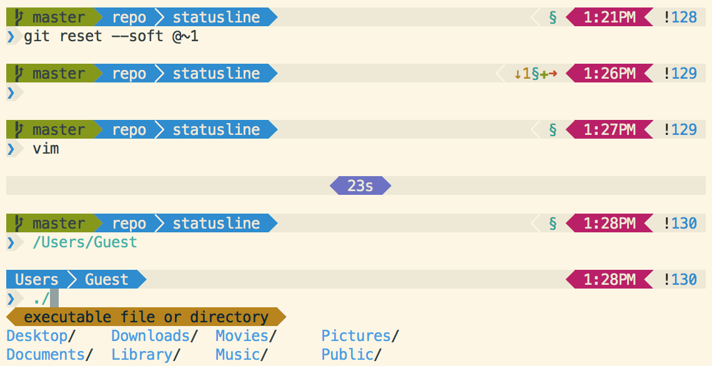

Statusline
===========



###A Powerline theme for prezto and oh-my-zsh

See the themes "agnoster" and "paradox" for comparison. This theme requires the powerline-patched menlo font, included [here.](MenloforPowerline-Regular.otf) You can find the dotfiles I use [here.](../dotfiles) Statusline is designed for solarized, and is compatible with the default OS X Terminal.app. This repo also contains [light](Solarized\ Light.terminal) and [dark](Solarized\ Dark.terminal) Terminal.app profiles. The prezto version is up to date; however, the oh-my-zsh version may not receive further updates. Only zsh 5.0.0+ and git 2.0.0+ are supported.

###[Prezto](https://github.com/sorin-ionescu/prezto)
The [prezto version](prompt_statusline_setup) is more optimized for zsh than the other version and runs much faster. It also shows additional git information, among other enhancements. Since it uses the prezto git and editor modules, it is not compatible with oh-my-zsh. However, I recommend prezto over oh-my-zsh because of faster prompt loading and less startup time.

####Features
- Asynchronous git status loading
- Task runtime
- Light and dark solarized themes
- Contextual segments
- Modular design (add and remove segments easily)
- Custom `PS1`, `RPS1`, `PS2`, `RPS2`, `PS3`, `PS4`, `SPROMPT`, and completion formatting
- Tmux support

####Installation
To move `prompt_statusline_setup` to your prezto installation folder, run
```zsh
curl -o ~/.zprezto/modules/prompt/functions/prompt_statusline_setup https://raw.githubusercontent.com/el1t/statusline/master/prompt_statusline_setup
```
In `zpreztorc`, ensure the following plugins are enabled:
```zsh
zstyle ':prezto:load' pmodule \
	'environment' \
	'terminal' \
	'editor' \
	'history' \
	'directory' \
	'spectrum' \
	'utility' \
	'completion' \
	'git' \
	'prompt'
```
Also in `zpreztorc`, change the theme setting as follows:
```zsh
zstyle ':prezto:module:prompt' theme 'statusline'            # Default light theme
zstyle ':prezto:module:prompt' theme 'statusline' 'dark'     # Solarized dark theme
zstyle ':prezto:module:prompt' theme 'statusline' 'light ''  # Light with transparent statusbar
```
Last but not least, ensure that this custom [patched font](MenloforPowerline-Regular.otf) is installed and enabled in your terminal.
Happy theming!

###[Oh-my-zsh](https://github.com/robbyrussell/oh-my-zsh)
The [oh-my-zsh version](statusline.zsh-theme) works without formatting errors found in previous agnoster themes, and has more git information and features compared to the original. I have attempted to optimize checking in large git repos. (In oh-my-zsh, make sure `DISABLE_UNTRACKED_FILES_DIRTY` is set to `true` in your `.zshrc` file for faster performance!)

NOTE: Mercurial support is untested and only for the oh-my-zsh version. The custom patched characters can be replaced with typical powerline patched ones, if you so choose; just edit the `_prompt_statusline_separator` variables at the top of the script.
